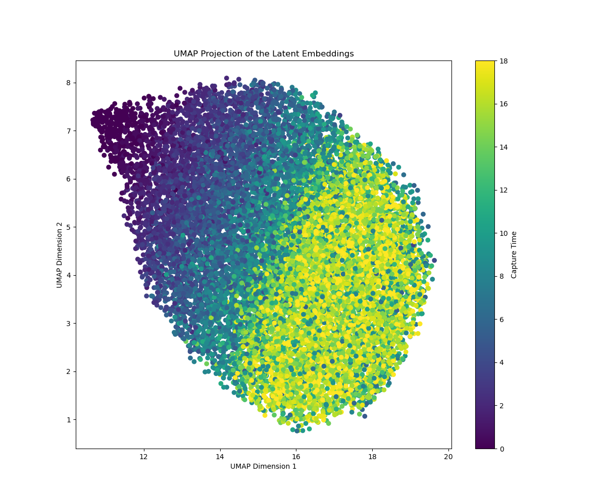
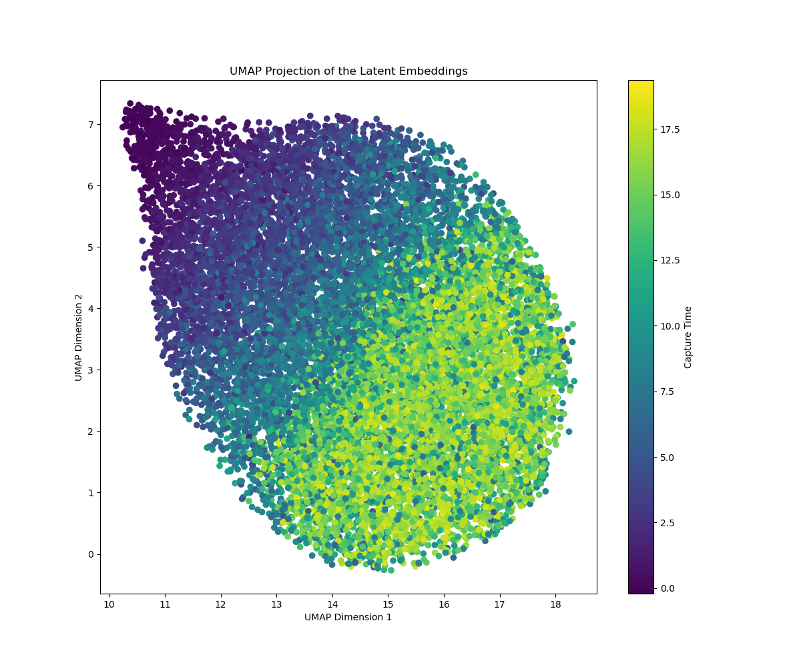

# 🧬 scVAE: A Time-Aware Variational Autoencoder for Single-Cell Trajectories


This project implements a **custom Variational Autoencoder (VAE)** trained on **single-cell gene expression data** with **temporal metadata**. It was originally developed for a course in Machine Learning for Computational Biology, but has evolved into an experiment in time-aware generative modeling.

Rather than predicting time directly, this VAE is trained to **embed cells in a latent space that reflects biological time**, using **capture time** as a prior during KL divergence calculation. The result is a compressed, smooth, and interpretable representation of gene expression trajectories over time — one that could be used to analyze development, progression, or response to perturbation.

---

## ✨ Key Features

- 🧠 **Time-aware KL divergence** — encodes cells in latent space near their known timepoints
- 🔁 **Generative model** — decode latent vectors to reconstruct gene expression
- 📈 **Smooth latent trajectories** — visualized with UMAP and colored by true or inferred time
- 🧪 **Custom loss function** — combines reconstruction error and time-anchored KL divergence
- 📦 Fully implemented in **PyTorch**, with clean modular code and plotting utilities

---

## 🔍 Visual Example

**UMAP projection of the learned latent space:**

<p align="center">
  
  
</p>

- Left: Colored by true capture time
- Right: Colored by posterior latent estimate of time

---

## 🧱 How It Works

The model consists of:

- An **encoder** (MLP) that outputs a latent distribution per cell
- A **reparameterization trick** to sample latent `z`
- A **decoder** that reconstructs gene expression from `z`
- A **custom KL loss** that compares the latent distribution to a Gaussian centered at the cell's capture time

This setup encourages the model to learn a biologically meaningful manifold that reflects **temporal progression** of cell states.

---

## 🚀 Getting Started

```bash
# Clone the repo
git clone https://github.com/yourusername/scVAE-time.git
cd scVAE-time

# Make sure you have the required packages
pip install torch numpy pandas matplotlib umap-learn

# Run training (requires .npy and .csv input files)
python scvae.py
```


## 🔮 Future Directions

This project opened my eyes to the power of generative models in biological data. Here are a few directions I'm eager to explore next:

🧭 **Unsupervised pseudotime learning** — replace true capture time with inferred priors
🌿 **Branching latent spaces** — model developmental bifurcations using mixture priors
🧬 **Multi-omics VAEs** — integrate epigenetic or chromatin accessibility alongside gene expression
🔁 **Interpolate cell states** — simulate intermediate states by sampling in latent space
🧪 **Drug response modeling** — condition VAE on treatment type to study cellular reprogramming

## 🧠 Why This Matters

Understanding cellular trajectories is essential in developmental biology, regenerative medicine, and disease progression. This model is a step toward building **generative**, **interpretable**, and **biologically grounded tools** for analyzing high-dimensional single-cell data.

If you're interested in building on this — or just want to geek out about VAEs in biology — feel free to connect!
